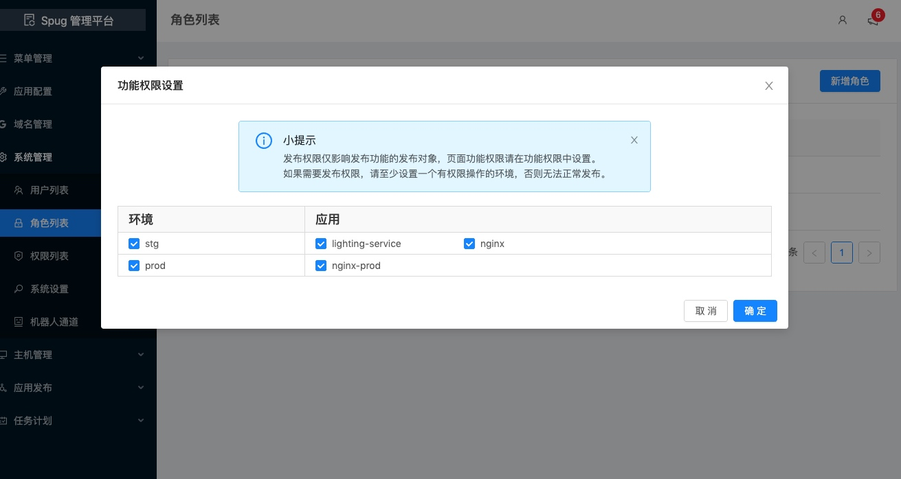
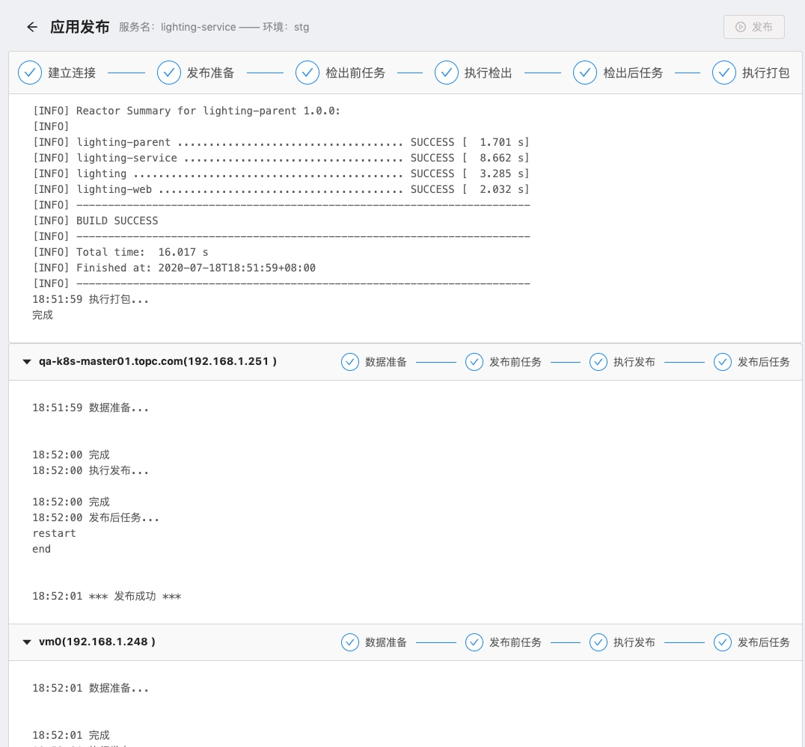
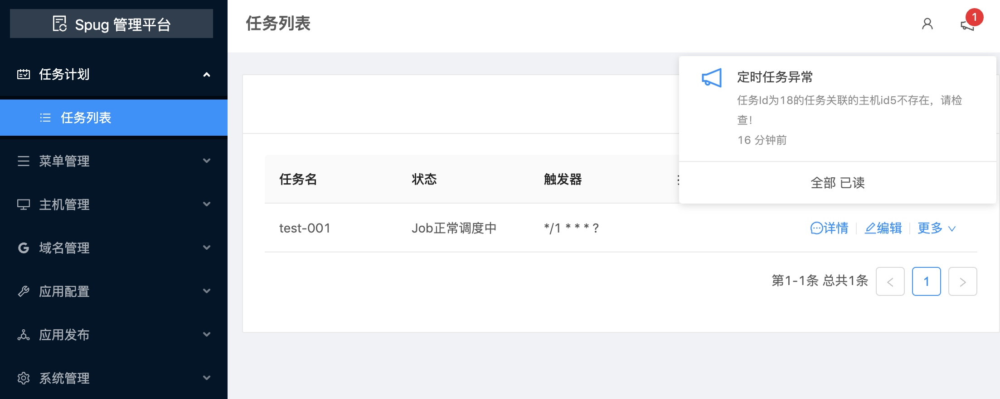
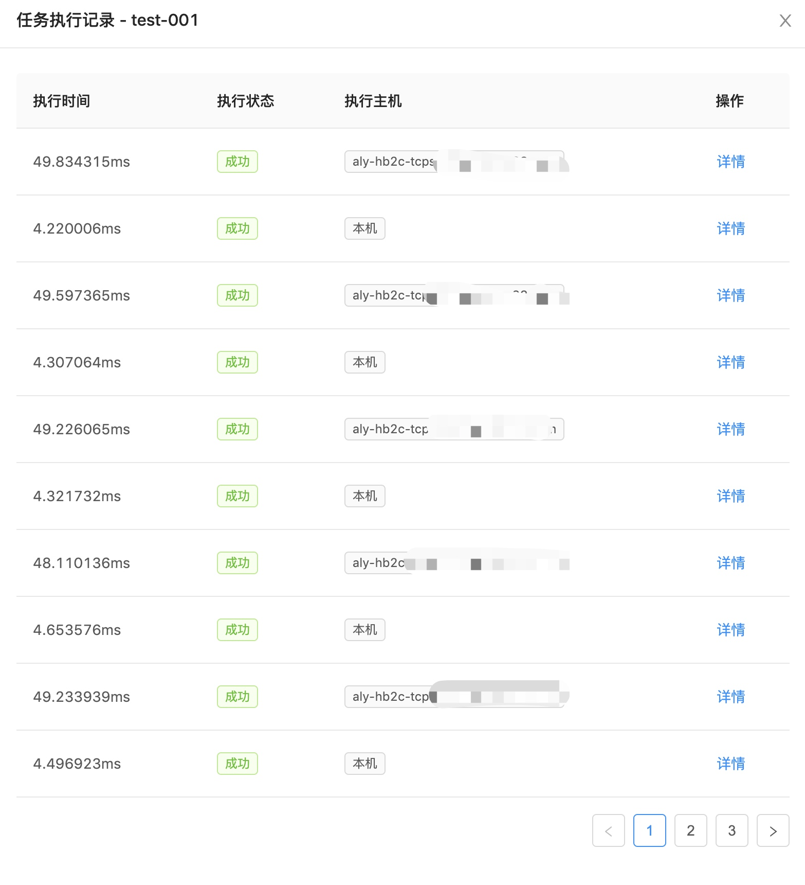
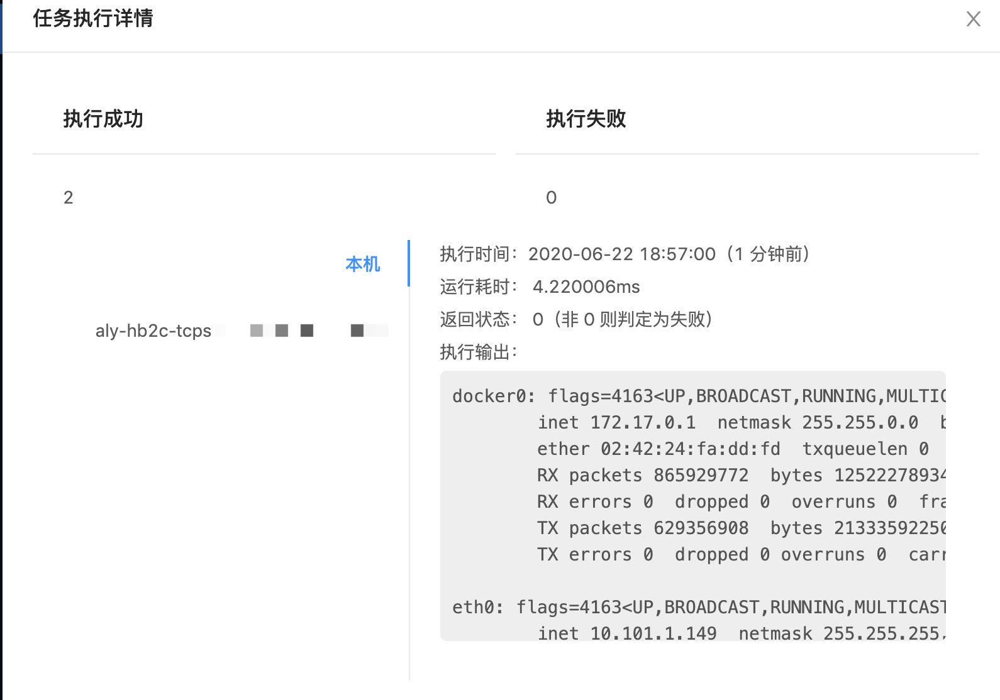

<h1 align="center">Golang Spug</h1>

## 环境

* go 1.13.5+
* Node 12.14
* React 16.11

## 特性

```
这个项目是一个go的运维管理项目， 基于gin封装的后台，基于react提供的前端。

实现了已下基本功能：
  用户管理
  权限管理
  角色授权
  发布部署
  在线终端
  域名管理
  证书管理
  任务计划
  通知提醒
  swagger

该项目实现逻辑基于 https://github.com/openspug/spug ，具体功能实现方式有不一样的地方，如任务计划的实现, 单独支持特定后端发布方式（如jar包标准发布包含了项目结构初始化等）。
目前已经满足运维发布平台需求，还有很多功能需要完善，望共勉。

增加多种后端类型的发布方式
三级/多级审核
审核结果通知和回调
支持ansible
支持k8s
支持openvpn（基于mysql认证）用户的管理(小众化的需求，暂时不做)
```
## Change Log
```
v2.1
增加 prometheus 性能监控指标和采集接口
增加 回滚限制 
    1：超过1天不允许回滚 
    2：有最新发布不允许回滚老版本
新增 Git tag 发布方式
新增 企业微信应用通知渠道
新增 企业微信机器人通知渠道
新增 自己定义邮件通知渠道
新增 主机批量导入功能
新增 应用发布权限和主机控制权限
新增 用户中心
重写 公私钥逻辑
重写 应用发布前后端内容
重构 域名证书的检验方式
    在线查询域名有效性
    在线查询证书有效性
重构 发布回滚 websock 返回数据更加友好优化
修复 获取 git 分支异常问题

v1.2
增加平台消息通知
增加钉钉消息通知
增加定时任务功能
增加系统定时任务 
  域名证书检测 
  任务失效性检查

v1.1
第一个版本
```
## 安装
### 前端

```
// 参考链接
https://ant.design/docs/react/introduce-cn

// 安装依赖
npm install

// 开发环境
umi dev
```
### 前端线上部署 
```
1）在项目前端的根目录下，执行
umi build

2) 把 dist 目录同步到线上机器需要部署的位置

3） 使用Nginx做部署， 配置文件如下。
做了来源访问限制。
```
```
# cat /etc/nginx/conf.d/omp.zhien88.com.conf
map $http_upgrade $connection_upgrade {
    default upgrade;
    '' close;
}


upstream omp {
    server 127.0.0.1:9090;
}

server {
    server_name omp.zhien88.com;
    listen 3000;
    gzip on;
    gzip_min_length 1k;
    gzip_comp_level 9;
    gzip_types text/plain application/javascript application/x-javascript text/css application/xml text/javascript application/x-httpd-php image/jpeg image/gif image/png;
    gzip_vary on;
    gzip_disable "MSIE [1-6]\.";
    #include /etc/nginx/ssl-params.conf;

    root /data/omp/web/dist;

    location @fallback {
        rewrite .* /index.html break;
    }

    location / {
        allow 10.0.0.0/8;
        allow 127.0.0.1;
        deny all;
        try_files $uri @fallback;
        autoindex on;
    }


    location /swagger/ {
        allow 10.0.0.0/8;
        allow 127.0.0.1;
        deny all;
        proxy_pass http://omp;
        proxy_read_timeout 300s;
        proxy_send_timeout 300s;

        proxy_set_header Host $host;
        proxy_set_header X-Real-IP $remote_addr;
        proxy_set_header X-Forwarded-For $proxy_add_x_forwarded_for;

        proxy_http_version 1.1;
        proxy_set_header Upgrade $http_upgrade;
        proxy_set_header Connection $connection_upgrade;
        client_max_body_size    100m;
    }

    location /admin/ {
        allow 10.0.0.0/8;
        allow 127.0.0.1;
        deny all;
        proxy_pass http://omp;
        proxy_read_timeout 300s;
        proxy_send_timeout 300s;

        proxy_set_header Host $host;
        proxy_set_header X-Real-IP $remote_addr;
        proxy_set_header X-Forwarded-For $proxy_add_x_forwarded_for;

        proxy_http_version 1.1;
        proxy_set_header Upgrade $http_upgrade;
        proxy_set_header Connection $connection_upgrade;
        client_max_body_size    100m;
    }
}
```
### 后端

```
1, 需要手动创建表结构
请预先创建好编码为utf8mb4的数据库，如 admin-go-api
导入基本表结构，文件在 files/admin-go-api.sql

2, 添加管理员
go run manage.go -c create_admin

3, 运行后台项目
go build main.go
```

### 后端线上部署
```
1) 打包成 linux 平台的二进制包 
CGO_ENABLED=0 GOOS=linux GOARCH=amd64 go build  main.go


2）copy 依赖目录和文件到部署机器的相应目录
[root@monitor ~]# cd /data/omp/api
[root@monitor api]# ll
总用量 44832
drwxr-xr-x 2 root root      4096 6月   6 15:20 conf
drwxr-xr-x 2 root root      4096 5月  11 17:49 docs
drwxr-xr-x 3 root root      4096 5月  11 17:49 files
-rwxr-xr-x 1  501 games 45879616 6月   6 23:15 main
-rw-r--r-- 1 root root      1807 5月  11 17:49 manage.go
drwxr-xr-x 6 root root      4096 6月   6 15:18 runtime
drwxr-xr-x 2 root root      4096 6月   5 20:33 templates


3）systemd  启动配置

[root@monitor api]# cat /etc/systemd/system/ompapi.service
[Unit]
Description=ompapi
After=network.target

[Service]
Type=simple
WorkingDirectory=/data/omp/api
ExecStart=/data/omp/api/main
RestartSec=10s
Restart=on-failure
UMask=0007

[Install]
WantedBy=multi-user.target

4) 启动和开机自启动
略
```
## 后端目录介绍

```
conf        // 配置目录
docs        // swagger文档目录
controller  // 主应用目录
main.go     // 入口程序
manage.go   // 初始化和启用管理用户的工具程序
middleware  // gin中间件
models      // 存储层接口
pkg         // 公共模块
routers     // 路由设置
runtime     // 运行生成的目录
templates   // 视图模板文件
files       // 系统运行或者初始化依赖文件
```

## 预览

















